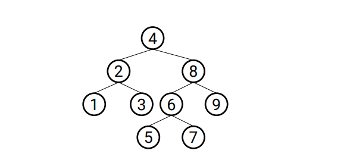

arvore analisada:

1. Implemente um algoritmo que visite todos os nós de uma árvore binária com uma
busca em profundidade in-order, pre-order e pos-order.

2. Implemente um algoritmo que visite todos os nós de uma árvore binária com uma
   busca em largura.
   ○ Exemplo, para a árvore abaixo a saída deve ser: 4, 2, 8, 1, 3, 6, 9, 5, 7